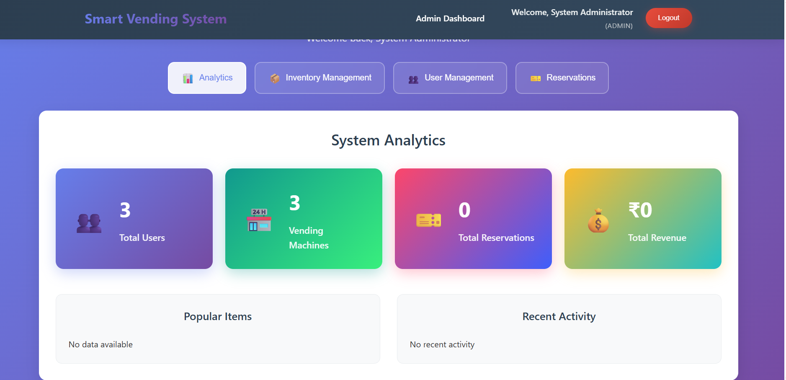
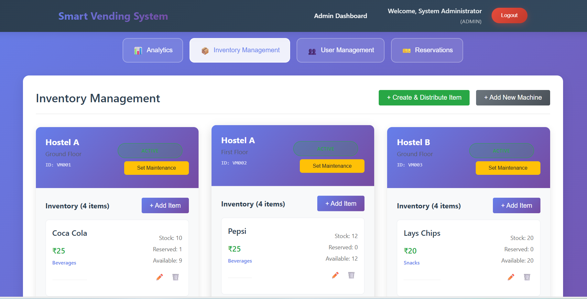
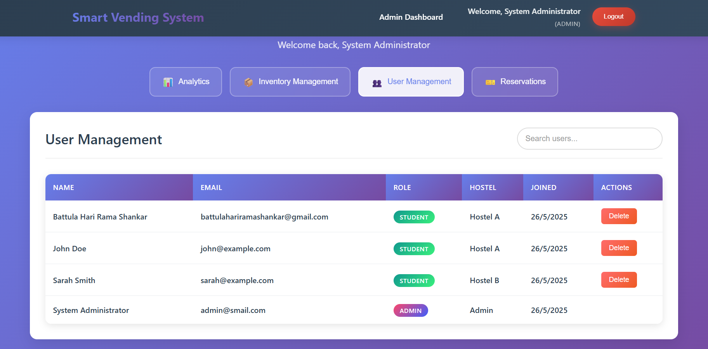
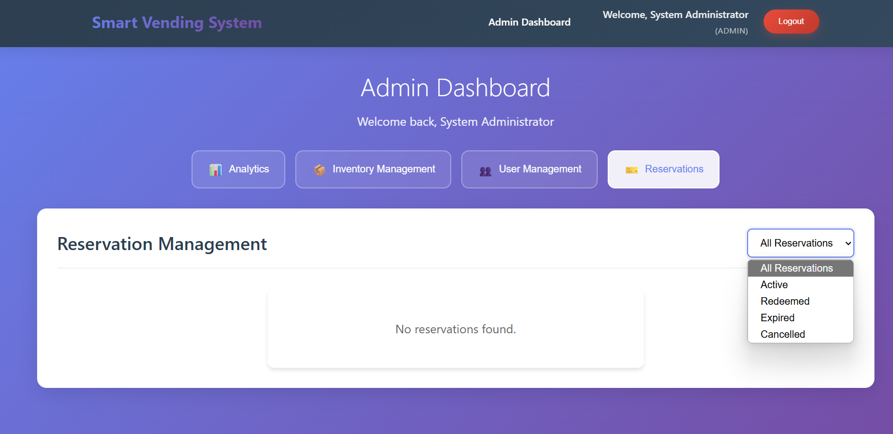
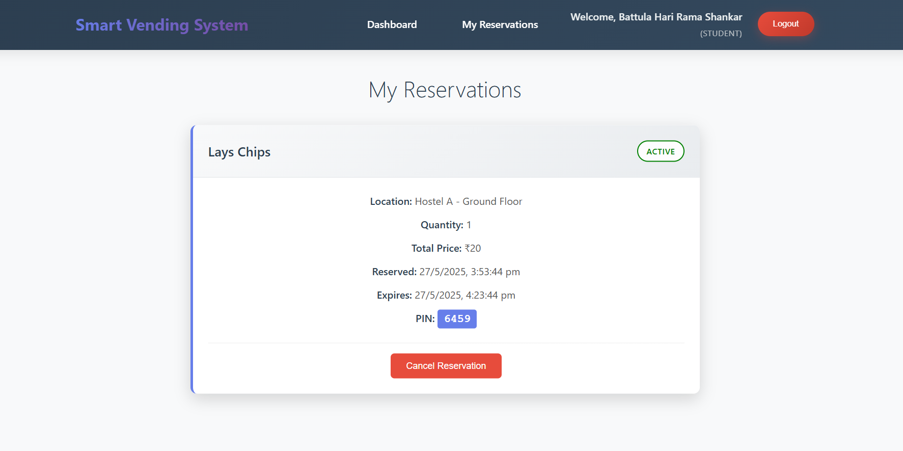

# 🤖 Smart Vending Machine Booking System

A full-stack MERN application designed to manage vending machine reservations in hostel campuses efficiently.

---

## 💡 Motivation

As a student at IIT Madras, I encountered a recurring problem with the vending machines in our hostels. Each hostel has one vending machine, typically located on the ground floor. I live in Cauvery Hostel, on the first floor, in a corner far from the vending area.

Whenever I felt hungry and went down to the vending machine, I often found it either empty or missing the snacks I preferred. This issue was frustrating—not just for me, but for many others. To make matters worse, checking vending machines in other hostels involved walking long distances, only to find the same situation or discover that the items had just been bought by someone else.

This led me to think: *What if we could check item availability before going down?* That’s when I decided to build a real-time solution that would help students view and reserve items from anywhere in the hostel.

---

## 🧠 Why I Used AI (Claude 4.0)

I had no prior experience in web development, so I turned to AI for assistance. I chose **Claude 4.0** because of its ability to provide accurate, context-aware coding suggestions, help debug issues, and guide me through learning full-stack development concepts.

Claude 4.0 acted as my virtual mentor throughout this project—helping me understand everything from React components to database schemas. It enabled me to focus on solving the real-world problem while learning development fundamentals on the go.

---

## 🗃️ Why MongoDB?

I chose **MongoDB** as the database for several reasons:

- **Flexibility**: MongoDB's document-based structure allowed me to model vending machine inventories easily without strict schemas.
- **Scalability**: As the system grows to include more hostels or campuses, MongoDB can handle increased load and complexity.
- **Real-time support**: It's well-suited to integrate with real-time applications using technologies like **Socket.io**, which I used for live inventory updates.

---
## 🧱 What is the MERN Stack?

The **MERN Stack** is a popular set of technologies used to build full-stack web applications. It consists of:

| Letter | Technology    | Description                                                                 |
|--------|----------------|-----------------------------------------------------------------------------|
| **M**  | **MongoDB**     | A NoSQL database that stores data in flexible, JSON-like documents.         |
| **E**  | **Express.js**  | A lightweight web framework for Node.js used to build APIs and web servers. |
| **R**  | **React.js**    | A JavaScript library for building user interfaces (UI), mostly for the frontend. |
| **N**  | **Node.js**     | A JavaScript runtime that allows you to run JavaScript code on the server side. |

---

## 🔄 How It Works Together

1. **Frontend (React.js)**  
   Users interact with a web page built using React. React handles the UI, state, and sends API requests to the backend.

2. **Backend (Express.js + Node.js)**  
   The Express server receives those requests. It processes them using Node.js logic.

3. **Database (MongoDB)**  
   Data such as user information or vending machine inventory is stored and retrieved from MongoDB. Express communicates with MongoDB using tools like Mongoose.

---

## 🔧 Why MERN?

- ✅ Uses **JavaScript** everywhere (frontend, backend, and database logic).
- 📚 Easy to learn and widely supported.
- ⚡ Ideal for building **real-time**, **scalable**, and **responsive** web applications.


## ✨ Features

- 🔄 **Real-time inventory tracking**
- 📲 **Item reservation system with QR code validation**
- 🛠️ **Admin dashboard for inventory and user management**
- 🔐 **User authentication with role-based access**
- 📱 **Fully responsive design for mobile and desktop**

---

## 🛠️ Tech Stack

- **Frontend**: React.js, Socket.io-client
- **Backend**: Node.js, Express.js, Socket.io
- **Database**: MongoDB
- **Authentication**: JWT

---

## 📦 Installation

### ⚙️ Prerequisites
- Node.js (v16 or higher)
- MongoDB

### 📥 Setup
1. Clone the repository:
   ```bash
   git clone https://github.com/yourusername/smart-vending-machine.git
   cd smart-vending-machine


## 🖼️ Website Preview 

### 🔐 Admin Dashboard (Overview)


### 📦 Admin - Inventory View


### ⚙️ Admin - User Managament Panel


### 📊 Admin - Reservations


### 👤 User Reservations Page


